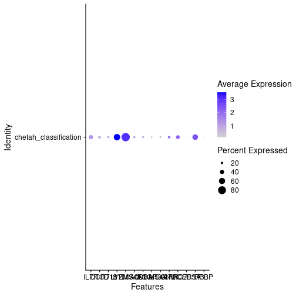
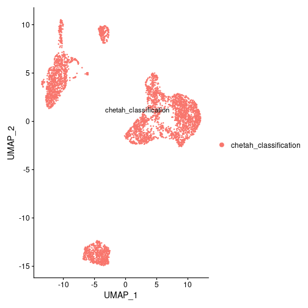

title: "Adapt a classifier: CHETAH example"
shorttitle: "Adapt a classifier"
author: Ghislain FIEVET <ghislain.fievet@gmail.com>
package: adveRSCarial
abstract: >
    adveRSCarial is an R Package designed for generating and analyzing the vulnerability of scRNA-seq
    classifiers to adversarial attacks. The package is versatile and provides a format for integrating
    any type of classifier. It offers functions for studying and generating two types of attacks,
    min change attack and max change attack. The min change attack involves making a small modification
    to the input to alter the classification. The max change attack involves making a large modification
    to the input without changing its classification.
    The package provides a comprehensive solution for evaluating the robustness of scRNA-seq classifiers
    against adversarial attacks.
output:
    BiocStyle::html_document:
        toc: true
        toc_depth: 2
vignette: >
  %\VignetteIndexEntry{adaptClassifier}
  %\VignetteEngine{knitr::knitr}
  %\VignetteEncoding{UTF-8}

# Load data
  

```r
library(adveRSCarial)
library(TENxPBMCData)
```


```r
pbmc <- TENxPBMCData(dataset = "pbmc3k")
mat_pbmc <- matrixFromSCE(pbmc)

cell_types <- system.file("extdata", "pbmc3k_cell_types.tsv", package="adveRSCarial")
cell_types <- read.table(cell_types, sep="\t")$cell_type
```

# Prepare a classifier with `CHETAH`

Here we demonstrate how to implement a classifier, and take the example of `CHETAH` a Bioconductor scRNA-seq classifier.

de Kanter JK, Lijnzaad P, Candelli T, Margaritis T, Holstege FCP (2019). “CHETAH: a selective, hierarchical cell type identification method for single-cell RNA sequencing.” Nucleic Acids Research. ISSN 0305-1048, doi: 10.1093/nar/gkz543.

First let's load a `train` and a `test` dataset.
Then we convert the `test` dataset into a `Seurat` object for visualization purpose.

```r
library(CHETAH)
library(Seurat)

# Load scRNA-seq datasets
train_3k <- TENxPBMCData(dataset = "pbmc3k")
test_4k <- TENxPBMCData(dataset = "pbmc4k")

cell_types_3k <- system.file("extdata", "pbmc3k_cell_types.tsv", package="adveRSCarial")
cell_types_3k <- read.table(cell_types_3k, sep="\t")
colData(train_3k)$celltypes <- cell_types_3k$cell_type
counts4seurat <- t(matrixFromSCE(test_4k))
pbmc <- CreateSeuratObject(counts = counts4seurat, project = "pbmc4k", min.cells = 3, min.features = 200)
# Filter, normalize and find features
pbmc[["percent.mt"]] <- PercentageFeatureSet(pbmc, pattern = "^MT-")
pbmc <- subset(pbmc, subset = nFeature_RNA > 200 & nFeature_RNA < 2500 & percent.mt < 5)
pbmc <- NormalizeData(pbmc, normalization.method = "LogNormalize", scale.factor = 10000)
pbmc <- FindVariableFeatures(pbmc, selection.method = "vst", nfeatures = 2000)
# Scale and run PCA
pbmc <- ScaleData(pbmc, features = rownames(pbmc))
pbmc <- RunPCA(pbmc, features = VariableFeatures(object = pbmc))
# Cluster and visualize
pbmc <- FindNeighbors(pbmc, dims = 1:10)
pbmc <- FindClusters(pbmc, resolution = 0.5)
pbmc <- RunUMAP(pbmc, dims = 1:10)
```

```
## Modularity Optimizer version 1.3.0 by Ludo Waltman and Nees Jan van Eck
## 
## Number of nodes: 4217
## Number of edges: 146577
## 
## Running Louvain algorithm...
## Maximum modularity in 10 random starts: 0.8969
## Number of communities: 10
## Elapsed time: 0 seconds
```

We annotate cells with `CHETAH`, and visualize the results.


```r
# Anotation with CHETAH
reference_3k <<- sceConvertToHGNC(train_3k)
input <- SingleCellExperiment(assays = list(counts = as.matrix(pbmc@assays$RNA@counts)))
input <- CHETAHclassifier(input = input, ref_cells = reference_3k)
input <- Classify(input = input, 0.00001)
pbmc@meta.data[['chetah_classification']] <- input$celltype_CHETAH
Idents(pbmc) <- 'chetah_classification'
# Known markers for each cell type
markers = c("IL7R", "CCR7", "CD14", "LYZ", "S100A4", "MS4A1", "CD8A", "FCGR3A", "MS4A7",
              "GNLY", "NKG7", "FCER1A", "CST3", "PPBP")
DotPlot(pbmc, features=markers)
```




```r
DimPlot(pbmc, reduction = "umap", label = TRUE, pt.size = 0.5)
```



## Adapt the classifier
`CHETAH` is a classifier that, when given a list of RNA values for a cell, returns a specific cell type from that list. We need to adjust the classifier so that it can assign a cell type to a group of cells.
    
A classifier function has to be formated as follow to be used with *adveRSCarial*:
```R
    classifier = function(expr, clusters, target){
                
                # `score` should be numeric between 0 and 1
                # 1 being the highest confidance into the cell type classification.
                c("cell type", score)
    }
```
    
The matrix `expr` contains RNA expression values, the vector `clusters` consists of the cluster IDs for each cell in `expr`, and `target` is the ID of the cluster for which we want to have a classification. The function returns a vector with the classification result, and a score.

This is how you can adapt `CHETAH` for `adveRSCarial`.

```r
CHETAHClassifier <- function(expr, clusters, target){
    if (!exists("reference_3k")) {
        reference_3k <<- train_3k
    }
    input <- SingleCellExperiment(assays = list(counts = t(expr)))
    input <- CHETAHclassifier(input = input, ref_cells = reference_3k)
    input <- Classify(input = input, 0.01)
    final_predictions = input$celltype_CHETAH[clusters == target]
    ratio <- as.numeric(sort(table(final_predictions), decreasing = TRUE)[1]) /
        sum(as.numeric(sort(table(final_predictions), decreasing = TRUE)))
    predicted_class <- names(sort(table(final_predictions), decreasing = TRUE)[1])
    if ( ratio < 0.3){
        predicted_class <- "NA"
    }
    c(predicted_class, ratio)
}
```

You can now test `CHETAH` classifier with `adveRSCarial` tools.

Let's run a `maxChangeAttack`. 


```r
rna_matrix <- t(as.matrix(pbmc@assays$RNA@counts))
clusters_id <- pbmc@meta.data[['chetah_classification']]
adv_max_change <- advMaxChange(rna_matrix, clusters_id, "DC", CHETAHClassifier, advMethod="perc99", maxSplitSize = 2000)
```


Let's run this attack and verify if it is successful.

First we modify the `rna_matrix` matrix on the target cluster, on the genes previously determined.
Then we verify that classification is still `DC`.

```r
mat_max_adver <- advModifications(rna_matrix, adv_max_change, clusters_id, "DC")
rf_result <- CHETAHClassifier(mat_max_adver, clusters_id, "DC")
rf_result
```

```
## [1] "DC"   "0.72"
```


```r
sessionInfo()
```

```
## R version 4.2.0 (2022-04-22)
## Platform: x86_64-pc-linux-gnu (64-bit)
## Running under: Ubuntu 20.04.4 LTS
## 
## Matrix products: default
## BLAS:   /usr/lib/x86_64-linux-gnu/blas/libblas.so.3.9.0
## LAPACK: /usr/lib/x86_64-linux-gnu/lapack/liblapack.so.3.9.0
## 
## locale:
##  [1] LC_CTYPE=en_US.UTF-8       LC_NUMERIC=C              
##  [3] LC_TIME=fr_FR.UTF-8        LC_COLLATE=en_US.UTF-8    
##  [5] LC_MONETARY=fr_FR.UTF-8    LC_MESSAGES=en_US.UTF-8   
##  [7] LC_PAPER=fr_FR.UTF-8       LC_NAME=C                 
##  [9] LC_ADDRESS=C               LC_TELEPHONE=C            
## [11] LC_MEASUREMENT=fr_FR.UTF-8 LC_IDENTIFICATION=C       
## 
## attached base packages:
## [1] stats4    stats     graphics  grDevices utils     datasets  methods  
## [8] base     
## 
## other attached packages:
##  [1] SeuratObject_4.1.3          Seurat_4.3.0               
##  [3] CHETAH_1.12.1               ggplot2_3.4.1              
##  [5] TENxPBMCData_1.14.0         HDF5Array_1.24.2           
##  [7] rhdf5_2.40.0                DelayedArray_0.22.0        
##  [9] Matrix_1.5-3                SingleCellExperiment_1.18.1
## [11] SummarizedExperiment_1.26.1 Biobase_2.56.0             
## [13] GenomicRanges_1.48.0        GenomeInfoDb_1.32.4        
## [15] IRanges_2.30.1              S4Vectors_0.34.0           
## [17] BiocGenerics_0.42.0         MatrixGenerics_1.8.1       
## [19] matrixStats_0.63.0          adveRSCarial_0.99.0        
## [21] BiocStyle_2.24.0           
## 
## loaded via a namespace (and not attached):
##   [1] AnnotationHub_3.4.0           corrplot_0.92                
##   [3] BiocFileCache_2.4.0           igraph_1.4.1                 
##   [5] plyr_1.8.8                    lazyeval_0.2.2               
##   [7] sp_1.6-0                      splines_4.2.0                
##   [9] listenv_0.9.0                 scattermore_0.8              
##  [11] digest_0.6.31                 htmltools_0.5.4              
##  [13] viridis_0.6.2                 fansi_1.0.4                  
##  [15] magrittr_2.0.3                memoise_2.0.1                
##  [17] tensor_1.5                    cluster_2.1.4                
##  [19] ROCR_1.0-11                   globals_0.16.2               
##  [21] Biostrings_2.64.1             spatstat.sparse_3.0-0        
##  [23] colorspace_2.1-0              blob_1.2.3                   
##  [25] rappdirs_0.3.3                ggrepel_0.9.3                
##  [27] xfun_0.37                     dplyr_1.1.0                  
##  [29] crayon_1.5.2                  RCurl_1.98-1.10              
##  [31] jsonlite_1.8.4                spatstat.data_3.0-0          
##  [33] progressr_0.13.0              zoo_1.8-11                   
##  [35] survival_3.5-3                glue_1.6.2                   
##  [37] polyclip_1.10-4               gtable_0.3.1                 
##  [39] zlibbioc_1.42.0               XVector_0.36.0               
##  [41] leiden_0.4.3                  Rhdf5lib_1.18.2              
##  [43] future.apply_1.10.0           abind_1.4-5                  
##  [45] scales_1.2.1                  pheatmap_1.0.12              
##  [47] DBI_1.1.3                     spatstat.random_3.1-3        
##  [49] miniUI_0.1.1.1                Rcpp_1.0.10                  
##  [51] viridisLite_0.4.1             xtable_1.8-4                 
##  [53] reticulate_1.28               bit_4.0.5                    
##  [55] htmlwidgets_1.6.1             httr_1.4.5                   
##  [57] RColorBrewer_1.1-3            ellipsis_0.3.2               
##  [59] ica_1.0-3                     farver_2.1.1                 
##  [61] pkgconfig_2.0.3               uwot_0.1.14                  
##  [63] deldir_1.0-6                  sass_0.4.5                   
##  [65] dbplyr_2.3.1                  utf8_1.2.3                   
##  [67] labeling_0.4.2                tidyselect_1.2.0             
##  [69] rlang_1.0.6                   reshape2_1.4.4               
##  [71] later_1.3.0                   AnnotationDbi_1.58.0         
##  [73] munsell_0.5.0                 BiocVersion_3.15.2           
##  [75] tools_4.2.0                   cachem_1.0.7                 
##  [77] cli_3.6.0                     generics_0.1.3               
##  [79] RSQLite_2.3.0                 ExperimentHub_2.4.0          
##  [81] ggridges_0.5.4                evaluate_0.20                
##  [83] stringr_1.5.0                 fastmap_1.1.1                
##  [85] goftest_1.2-3                 yaml_2.3.7                   
##  [87] bioDist_1.68.0                knitr_1.42                   
##  [89] bit64_4.0.5                   fitdistrplus_1.1-8           
##  [91] purrr_1.0.1                   RANN_2.6.1                   
##  [93] KEGGREST_1.36.3               dendextend_1.16.0            
##  [95] nlme_3.1-162                  pbapply_1.7-0                
##  [97] future_1.31.0                 mime_0.12                    
##  [99] compiler_4.2.0                plotly_4.10.1                
## [101] filelock_1.0.2                curl_5.0.0                   
## [103] png_0.1-8                     interactiveDisplayBase_1.34.0
## [105] spatstat.utils_3.0-1          tibble_3.1.8                 
## [107] bslib_0.4.2                   stringi_1.7.12               
## [109] highr_0.10                    lattice_0.20-45              
## [111] commonmark_1.8.1              markdown_1.5                 
## [113] vctrs_0.5.2                   pillar_1.8.1                 
## [115] lifecycle_1.0.3               rhdf5filters_1.8.0           
## [117] BiocManager_1.30.20           spatstat.geom_3.0-6          
## [119] lmtest_0.9-40                 jquerylib_0.1.4              
## [121] RcppAnnoy_0.0.20              irlba_2.3.5.1                
## [123] data.table_1.14.8             cowplot_1.1.1                
## [125] bitops_1.0-7                  patchwork_1.1.2              
## [127] httpuv_1.6.9                  R6_2.5.1                     
## [129] bookdown_0.32                 promises_1.2.0.1             
## [131] KernSmooth_2.23-20            gridExtra_2.3                
## [133] parallelly_1.34.0             codetools_0.2-19             
## [135] MASS_7.3-57                   withr_2.5.0                  
## [137] sctransform_0.3.5             GenomeInfoDbData_1.2.8       
## [139] parallel_4.2.0                grid_4.2.0                   
## [141] tidyr_1.3.0                   rmarkdown_2.20               
## [143] Rtsne_0.16                    spatstat.explore_3.0-6       
## [145] shiny_1.7.4
```
