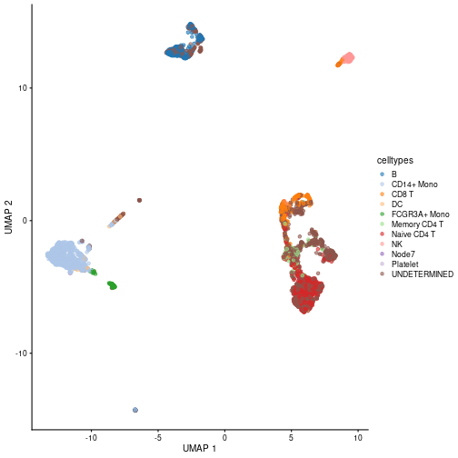

title: "adverSCarial, generate and analyze the vulnerability of scRNA-seq
    classifiers to adversarial attacks"
shorttitle: "adverSCarial"
author: Ghislain FIEVET <ghislain.fievet@gmail.com>
package: adverSCarial
abstract: >
    adverSCarial is an R Package designed for generating and analyzing the vulnerability of scRNA-seq
    classifiers to adversarial attacks. The package is versatile and provides a format for integrating
    any type of classifier. It offers functions for studying and generating two types of attacks,
    single gene attack and max change attack. The single gene attack involves making a small modification
    to the input to alter the classification. The max change attack involves making a large modification
    to the input without changing its classification.
    The package provides a comprehensive solution for evaluating the robustness of scRNA-seq classifiers
    against adversarial attacks.
output:
    BiocStyle::html_document:
        toc: true
        toc_depth: 2
vignette: >
  %\VignetteIndexEntry{Vign03_adaptClassifier}
  %\VignetteEngine{knitr::knitr}
  %\VignetteEncoding{UTF-8}

# Prepare a classifier with `CHETAH`

Here we demonstrate how to implement a classifier, and take the example of `CHETAH` a Bioconductor scRNA-seq classifier.

de Kanter JK, Lijnzaad P, Candelli T, Margaritis T, Holstege FCP (2019). “CHETAH: a selective, hierarchical cell type identification method for single-cell RNA sequencing.” Nucleic Acids Research. ISSN 0305-1048, doi: 10.1093/nar/gkz543.

# Load data
  

```r
library(adverSCarial)
library(TENxPBMCData)
library(CHETAH)
library(scater)
library(scran)
```

First let's load a `train` and a `test` dataset.

```r
train_3k <- TENxPBMCData(dataset = "pbmc3k")
test_4k <- TENxPBMCData(dataset = "pbmc4k")

cell_types_3k <- system.file("extdata", "pbmc3k_cell_types.tsv", package="adverSCarial")
cell_types_3k <- read.table(cell_types_3k, sep="\t")
colData(train_3k)$celltypes <- cell_types_3k$cell_type
colnames(train_3k) <- colData(train_3k)[['Barcode']]
colnames(test_4k) <- colData(test_4k)[['Barcode']]
```


Then we process the `test_4k` to annotate and visualize the cell types.

We annotate cells with `CHETAH`, and process data.


```r
input <- CHETAHclassifier(input = test_4k, ref_cells = train_3k)
input <- Classify(input = input, 0.00001)
colData(test_4k)$celltypes <- input$celltype_CHETAH

test_4k <- logNormCounts(test_4k)
dec <- modelGeneVar(test_4k)
hvg <- getTopHVGs(dec, prop=0.1)
test_4k <- runPCA(test_4k, ncomponents=25, subset_row=hvg)
test_4k <- runUMAP(test_4k, dimred = 'PCA')
```

Visualize the results


```r
plotUMAP(test_4k, colour_by="celltypes")
```




## Adapt the classifier
`CHETAH` is a classifier that, when given a SingleCellExperiment object, returns a specific cell type from each cell. We need to adjust the classifier so that it can be used by *adverSCarial*.
    
Each classifier function has to be formated as follow to be used with *adverSCarial*:
```R
    classifier = function(expr, clusters, target){
                
                # `score` should be numeric between 0 and 1
                # 1 being the highest confidance into the cell type classification.
                c("cell type", score)
    }
```
    
The `expr` argument contrains the RNA expression values, should be a *DelayedMatrix* or a *SingleCellExperiment*.
The list `clusters` consists of the cluster IDs for each cell in `expr`, and `target` is the ID of the cluster for which we want to have a classification. The function returns a vector with the classification result, and a trust indice.

This is how you can adapt `CHETAH` for `adverSCarial`.

```r
CHETAHClassifier <- function(expr, clusters, target){
    reference_3k <- train_3k
    input <- CHETAHclassifier(input = expr, ref_cells = reference_3k)
    input <- Classify(input = input, 0.01)
    final_predictions = input$celltype_CHETAH[clusters == target]
    ratio <- as.numeric(sort(table(final_predictions), decreasing = TRUE)[1]) /
        sum(as.numeric(sort(table(final_predictions), decreasing = TRUE)))
    predicted_class <- names(sort(table(final_predictions), decreasing = TRUE)[1])
    if ( ratio < 0.3){
        predicted_class <- "NA"
    }
    c(predicted_class, ratio)
}
```

This classifier takes as input a SingleCellExperiment object, you need to specify the `argForClassif="SingleCellExperiment"`
argument in *adverSCarial* function. If the classifier takes as input a *DelayedMatrix* you can let the default 
`argForClassif="DelayedMatrix"` argument.

You can now test `CHETAH` classifier with `adverSCarial` tools.

Let's run a `maxChangeAttack`.
If you have enough available memory we recommand to use the `argForModif="data.frame"` option, which is faster.


```r
adv_max_change <- advMaxChange(test_4k, colData(test_4k)$celltypes, "CD14+ Mono", CHETAHClassifier, advMethod="perc99",    maxSplitSize = 2000, argForClassif="SingleCellExperiment", argForModif="data.frame")
```


Let's run this attack and verify if it is successful.

First we modify the `test_4k` SingleCellExperiment object on the target cluster, on the genes previously determined.
Then we verify that classification is still `CD14+ Mono`.

```r
test_4k_adver <- advModifications(test_4k, adv_max_change@values, colData(test_4k)$celltypes, "CD14+ Mono",
	argForClassif="SingleCellExperiment", argForModif="data.frame")

rf_result <- CHETAHClassifier(test_4k_adver, colData(test_4k)$celltypes, "CD14+ Mono")

rf_result
```

```
## [1] "CD14+ Mono" "1"
```


```r
sessionInfo()
```

```
## R version 4.3.0 (2023-04-21)
## Platform: x86_64-pc-linux-gnu (64-bit)
## Running under: Ubuntu 22.04.1 LTS
## 
## Matrix products: default
## BLAS:   /usr/lib/x86_64-linux-gnu/blas/libblas.so.3.10.0 
## LAPACK: /usr/lib/x86_64-linux-gnu/lapack/liblapack.so.3.10.0
## 
## locale:
##  [1] LC_CTYPE=en_US.UTF-8       LC_NUMERIC=C              
##  [3] LC_TIME=fr_FR.UTF-8        LC_COLLATE=en_US.UTF-8    
##  [5] LC_MONETARY=fr_FR.UTF-8    LC_MESSAGES=en_US.UTF-8   
##  [7] LC_PAPER=fr_FR.UTF-8       LC_NAME=C                 
##  [9] LC_ADDRESS=C               LC_TELEPHONE=C            
## [11] LC_MEASUREMENT=fr_FR.UTF-8 LC_IDENTIFICATION=C       
## 
## time zone: Europe/Paris
## tzcode source: system (glibc)
## 
## attached base packages:
## [1] stats4    stats     graphics  grDevices utils     datasets  methods  
## [8] base     
## 
## other attached packages:
##  [1] scran_1.28.1                scater_1.28.0              
##  [3] scuttle_1.10.1              CHETAH_1.16.0              
##  [5] ggplot2_3.4.2               TENxPBMCData_1.18.0        
##  [7] HDF5Array_1.28.1            rhdf5_2.44.0               
##  [9] DelayedArray_0.26.3         S4Arrays_1.0.4             
## [11] Matrix_1.5-4.1              SingleCellExperiment_1.22.0
## [13] SummarizedExperiment_1.30.1 Biobase_2.60.0             
## [15] GenomicRanges_1.52.0        GenomeInfoDb_1.36.0        
## [17] IRanges_2.34.0              S4Vectors_0.38.1           
## [19] BiocGenerics_0.46.0         MatrixGenerics_1.12.0      
## [21] matrixStats_0.63.0          adverSCarial_0.99.38       
## [23] knitr_1.42                 
## 
## loaded via a namespace (and not attached):
##   [1] RColorBrewer_1.1-3            jsonlite_1.8.4               
##   [3] magrittr_2.0.3                ggbeeswarm_0.7.2             
##   [5] farver_2.1.1                  corrplot_0.92                
##   [7] zlibbioc_1.46.0               vctrs_0.6.2                  
##   [9] memoise_2.0.1                 DelayedMatrixStats_1.22.0    
##  [11] RCurl_1.98-1.12               base64enc_0.1-3              
##  [13] htmltools_0.5.5               AnnotationHub_3.8.0          
##  [15] curl_5.0.0                    BiocNeighbors_1.18.0         
##  [17] Rhdf5lib_1.22.0               htmlwidgets_1.6.2            
##  [19] plyr_1.8.8                    plotly_4.10.1                
##  [21] cachem_1.0.8                  uuid_1.1-0                   
##  [23] igraph_1.4.2                  mime_0.12                    
##  [25] lifecycle_1.0.3               pkgconfig_2.0.3              
##  [27] rsvd_1.0.5                    R6_2.5.1                     
##  [29] fastmap_1.1.1                 GenomeInfoDbData_1.2.10      
##  [31] shiny_1.7.4                   digest_0.6.31                
##  [33] colorspace_2.1-0              AnnotationDbi_1.62.1         
##  [35] dqrng_0.3.0                   irlba_2.3.5.1                
##  [37] ExperimentHub_2.8.0           RSQLite_2.3.1                
##  [39] beachmat_2.16.0               labeling_0.4.2               
##  [41] filelock_1.0.2                fansi_1.0.4                  
##  [43] httr_1.4.6                    compiler_4.3.0               
##  [45] bit64_4.0.5                   withr_2.5.0                  
##  [47] BiocParallel_1.34.1           viridis_0.6.3                
##  [49] DBI_1.1.3                     highr_0.10                   
##  [51] dendextend_1.17.1             rappdirs_0.3.3               
##  [53] bluster_1.10.0                tools_4.3.0                  
##  [55] vipor_0.4.5                   beeswarm_0.4.0               
##  [57] interactiveDisplayBase_1.38.0 httpuv_1.6.11                
##  [59] glue_1.6.2                    rhdf5filters_1.12.1          
##  [61] promises_1.2.0.1              grid_4.3.0                   
##  [63] pbdZMQ_0.3-9                  cluster_2.1.4                
##  [65] reshape2_1.4.4                generics_0.1.3               
##  [67] gtable_0.3.3                  tidyr_1.3.0                  
##  [69] data.table_1.14.8             metapod_1.8.0                
##  [71] BiocSingular_1.16.0           ScaledMatrix_1.8.1           
##  [73] utf8_1.2.3                    XVector_0.40.0               
##  [75] RcppAnnoy_0.0.20              ggrepel_0.9.3                
##  [77] BiocVersion_3.17.1            pillar_1.9.0                 
##  [79] stringr_1.5.0                 limma_3.56.1                 
##  [81] IRdisplay_1.1                 later_1.3.1                  
##  [83] dplyr_1.1.2                   BiocFileCache_2.8.0          
##  [85] lattice_0.21-8                bit_4.0.5                    
##  [87] tidyselect_1.2.0              locfit_1.5-9.7               
##  [89] Biostrings_2.68.1             gridExtra_2.3                
##  [91] edgeR_3.42.2                  xfun_0.39                    
##  [93] statmod_1.5.0                 pheatmap_1.0.12              
##  [95] stringi_1.7.12                lazyeval_0.2.2               
##  [97] yaml_2.3.7                    evaluate_0.21                
##  [99] codetools_0.2-19              tibble_3.2.1                 
## [101] BiocManager_1.30.20           cli_3.6.1                    
## [103] uwot_0.1.14                   IRkernel_1.3.2               
## [105] xtable_1.8-4                  repr_1.1.6                   
## [107] munsell_0.5.0                 Rcpp_1.0.10                  
## [109] bioDist_1.72.0                dbplyr_2.3.2                 
## [111] png_0.1-8                     parallel_4.3.0               
## [113] ellipsis_0.3.2                blob_1.2.4                   
## [115] sparseMatrixStats_1.12.0      bitops_1.0-7                 
## [117] viridisLite_0.4.2             scales_1.2.1                 
## [119] purrr_1.0.1                   crayon_1.5.2                 
## [121] rlang_1.1.1                   cowplot_1.1.1                
## [123] KEGGREST_1.40.0
```
